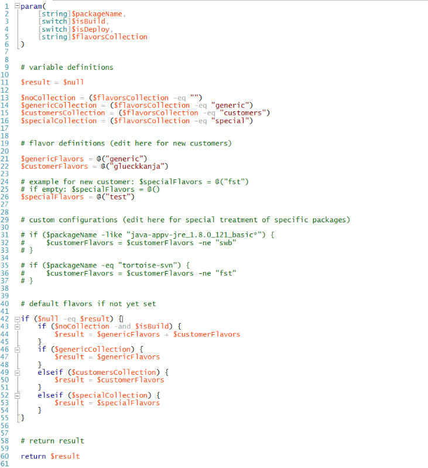
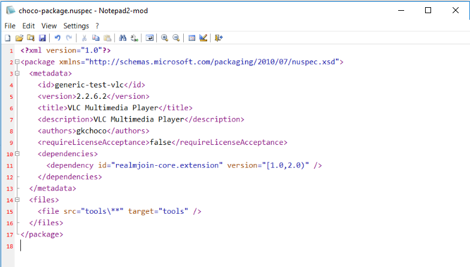
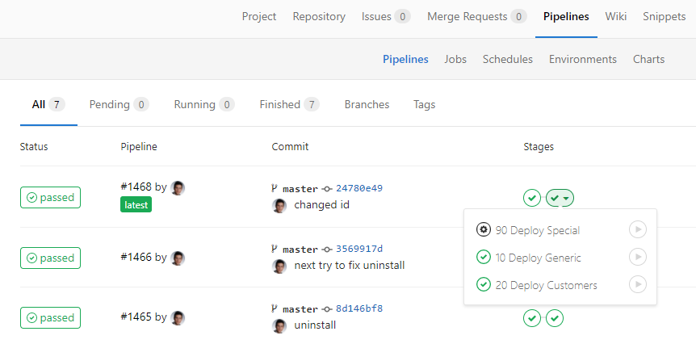
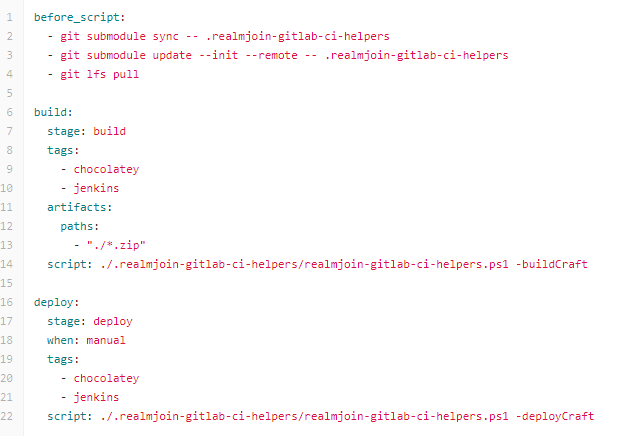
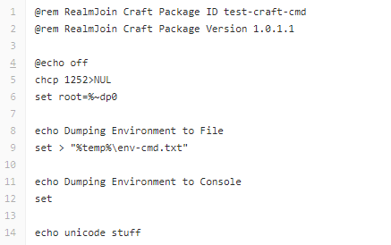
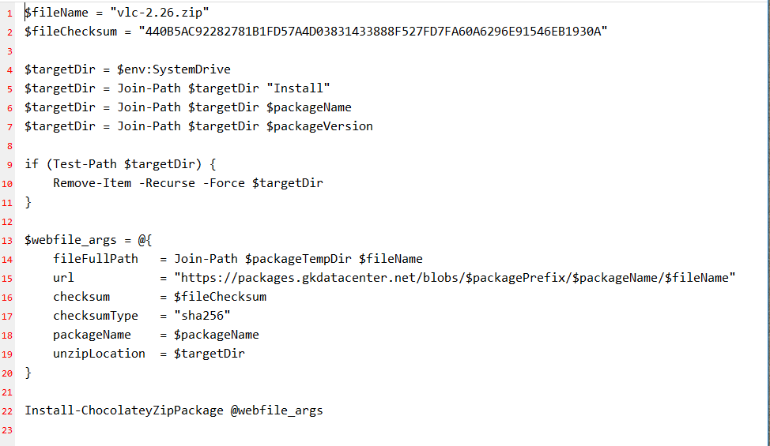

# Creating packages
  
    
  
The picture above provides a schematic overview over the RealmJoin package distribution ecosystem. The step of creating packages will be illuminiated in this chapter. 
It documents the basic steps in creating craft, chocolatey, chocolatey App-V and organic packages. While all types follow the same rough outline, there are some differences when handling the packages. 

## General Steps
This section describes the shared steps for craft and chocolatey packages. The packaging process will be demonstrated on the well known **VLC player**.

### Create local repository folder
Run cmd.exe as administrator and navigate to the desired folder, in which the packages are to be created. Then create a new folder for the new repository:
```mkdir videolan-vlc-2.26```

### Use Jumpstarter to create repository
Gk provides a Jumpstarter script that can be used to automatically create the template for a new package. Run the following code in the cmd shell: 

```
@"%SystemRoot%\System32\WindowsPowerShell\v1.0\powershell.exe" -NoProfile -ExecutionPolicy Bypass -Command "iex ((New-Object System.Net.WebClient).DownloadString('https://raw.githubusercontent.com/realmjoin/realmjoin-package-jumpstarter/master/JumpstartRealmJoinPackage.ps1'))"
```
Optional parameters are ``-DoNotCloneRepository`` and ``-DoNotCopyTemplate``.   
After the execution you are confronted by the following prompt and asked to specify details:
```
Repository path (leave empty for current folder name, Format: {VENDOR}-{PRODUCTNAME}): videolan-vlc
Repository name (leave empty for repository path): Videolan VLC Player
Repository namespace (leave empty for 'generic-packages', Format: {CUSTOMER}-packages): (your namespace)
Personal Access Token:(your token)   
Cloning into....[installation messages]
[...]
Possible Packagetypes:
  [1] Chocolatey
  [2] Chocolatey and Usersettings
  [3] Chocolatey and multi Usersettings
  [4] Craft
Please enter the type of package. (all samples found in: '.realmjoin-gitlab-ci-helpers'): 1
Please enter the PackageVersion (Format: 1.0.0.0): w.x.y.z
```  
  
  

After a short while, a new repository is created and the template files are copied into the local package folder. Files not necessary for the selected package type will be deleted. If the correct package version and type are selected, it is not necessary to edit the `choco-package.nuspec` and ```.gitlab-ci.yml``` files. Nevertheless it is highly recommended to check those files for consistency.  
Before working on the files, please check the *readme.md*. Depending on the type of package that is to be created, the next steps will vary.  
#### Jumpstarter Beta
RealmJoin and the automatization tools are constantly adapted and refined. Advanced features are implemented and tested in a beta branch. 
The beta version of the Jumpstarter script can be used by running the following code in a cmd shell:  
```
@"%SystemRoot%\System32\WindowsPowerShell\v1.0\powershell.exe" -NoProfile -ExecutionPolicy Bypass -Command "iex ((New-Object System.Net.WebClient).DownloadString('https://raw.githubusercontent.com/realmjoin/realmjoin-package-jumpstarter/raw/beta/JumpstartRealmJoinPackage.ps1'))"
```

## Chocolatey Package
### Edit Package files
   
* Create ```.gitlab-ci.yml```  
  There are 8 different sample files (might be already deleted when using a *Jumpstarter* script and selecting a specific package type), while those starting with `Sample1*` are considered outdated. Therefore, select and edit the most fitting ```Sample0*.gitlab-ci.yml``` file and delete the other ones. You might need to adjust the content. Remove the prefix of the filename and save it as ```.gitlab-ci.yml```.   
   
  
  
  The `.gitlab-ci.yml`file contain the build and deploy information. In the *build* stage, the `build-deploy.ps1` helper script is called, while the argument `-build` indicates the *build* stage and `-ChocoMachine` the chocolatey type package. 
  In the *deploy* stage, the `build-deploy.ps1` helper script is called, while the argument `-deploy` indicates the *deploy* stage, `-ChocoMachine` the chocolatey type package and depending on the deploy mode, the *-flavourCollection*: 
   * Deploy Generic: Deployment of the *-flavourCollection* *generic*.
   * Deploy Customers: Deployment of the *-flavourCollection* *customers*, the deployment for all users. 
   * Deploy Special: Deployment of the *-flavourCollection* *special*, the deployment for only the 
  Those options are not available for customized packages, where only one deploy mode exists, therefore making the distinction obsolete. 
  See next step for the configuration of *flavours* and section *Conventions and helpers* for more detailed information on the helper scripts.
* Check `build-deploy-flavor-definitions.ps1`
  Check the file `.realmjoin-gitlab-ci-helpers/build-deploy-flavor-definitions.ps1` for your desired flavour. 
  If it is not included in the `$genericFlavors`, `$specialFlavors` or `$customerFlavors` range, the helperscript has to be adjusted. Please contact the responsible person.  
     
* Customize ```choco-package.nuspec```   
  Add the metadata according to the desired software. 
  
  * id: *flavour-vendor-program*. It is necessary to add *generic* for non-customized packages.
  * version: Package version *W.X.Y.Z*. See section *Conventions and helpers* for more detailed information on the numbering convention.
  * title: Displayed name of the package.
  * description: Description of the package.
  * authors: Creator of the package.
  * requireLicenseAcceptance: *true/false*.
* Move binaries  
  Move the executables, installer or zip files into the subfolder ```blobs```. Make sure the files name does not contain spaces or irregular characters but does contain the version number.  
* Create SHA256 hash  
  Open a Powershell and navigate into the ```blobs``` subfolder. Execute 
  ```
  Get-ChildItem | % {(Get-FileHash $_.name).hash + " *" + $_.name | out-file ($_.name + ".sha256")}
  ```
  A `*.sha256` file is created for every item in the folder. The command is also listed in the placeholder file ```zzz_Place_installer_files_here_and_delete_me.txt```, which is to be deleted afterwards (as well as any ```zzz_Place_installer_files_here_and_delete_me.txt.sha256``` item). 
  Alternatively it is possible to run the ``mh_hash.cmd`` with elevated rights to automatically create the hash file.   
* Customize ```tools\chocolateyInstall.ps1```  
  Based on the samples in the file, choose the most fitting one and adapt accordingly. To ad additional installation parameters, the ```-silentArgs""``` or ```-additionalArgs``` options may be used.  
  
* Customize `rj_install.cmd` and `rj_install.ps1`  
    * With User Settings  
      * Customize one of `usersettings\rj_install.cmd` and `usersettings\rj_install.ps1`, if necessary, and delete the other one. This file may contain various modifications and adjustments, e.g. registry keys or (un-)pinning of start icons.
      * Delete `rj_install.cmd` and `rj_install.ps1` in root folder.
    * Without User Settings  
      * Delete subfolder `usersettings` completely.
      * Delete`rj_install.cmd` and `rj_install.ps1` in root folder.
* Rewrite ```Readme.md```  
  Provide all information necessary in the ```Readme.md``` file. Alternatively delete the file completely. 
* Upload  
  Commit the file and upload it with Git to the Gitlab. 
* Deploy package   
  After uploading the package to Gitlab, navigate with a browser of your choice into the repository and select the *Pipelines* section. Select your release and use the deploy function. Depending on the package type, there are different possibilites. 
  * 10 generic: Deploys a new version of the generic flavour package.
  * 20 customers: Deploys a new version of all customer flavour packages. Do not do this, if you do not want to deploy a new version for all flavours listed here.
  * 90 special: Deploys a new version of the special flavour package. This is used, when a package is already deployed for more than one customer. It prevents unwanted deployment of new package versions.  
  
After the successfull deployment, the package can be found in the chocolatey library and added. See chapter *managing RealmJoin* for information on assigning packages.  

#### Installers in zip-files
In some cases *.msi* or *.exe* installers require additional files in their execution folder. It is possible, to merge the installer and additional files in a zip container and execute the installer without unpacking forehand.  
To do so, the zip container is put into the *blobs* folder and a hash value has to be created. In the *chocolateyInstall.ps1*, the install command may be used as described above, but the installer file has to be escaped with *#*, installation parameters can be provide similar to simpler cases :  
´´´
 Install-ChocolateyRealmjoinPackage "CONTAINER.zip#INSTALLER.msi" "HASH" -additionalArgs "/Additional Args"
´´´

#### Installation Pre-Actions  
The *Install-ChocolateyRealmjoinPackage* command can be run with the execution of pre-actions:  
```
Install-ChocolateyRealmjoinPackage "INSTALLER.msi" "HASH" -preActions {param($setupFolder) Copy-Item -force "$packageToolsFolder\Oracle CONFIG.ini" $setupFolder }
```

#### Installation Post-Actions 
The *Install-ChocolateyRealmjoinPackage* command can be run with the execution of post-actions:  
```
Install-ChocolateyRealmjoinPackage "INSTALLER.msi" "HASH" -postActions { Remove-Item "$env:PUBLIC\Desktop\SHORTCUT.lnk" -ErrorAction SilentlyContinue }
```

### Parameters in chocolatey packages   
To utilize parameters in chocolatey packages, it is necessary to invoke the read-out of the entered text in the optional [args](http://docs.realmjoin.com/managing-realmjoin.html#add-packages) text field: ```Import-ChocolateyRealmjoinPackageParameters ```.  
The chocolatey extension now parses the argument string and automatically creates and fill the variables with the following pattern:  
Example parameters: ```"/Key:xx-yy-cc /Language:EN"```  
Available variables: ```$packParamKey``` with value ```xx-yy-cc``` and ```$packParamLanguage``` with value ```EN```   
Those variables may now be used for any purposes within the *chocolatyinstall.ps1* script.  

## Craft Package
### Edit Package files
* Delete non-craft items  
  Delete subfolders `blobs`, `tools` and `usersettings` and file `choco-package.nuspec`.
* Create ```.gitlab-ci.yml```  
  Select and add the most fitting ```sample*.gitlab-ci.yml``` file and delete the other ones. In the following example, the *flavour* [companyname] was added, to provide the package with the desired corporate meta data. **NOTE:** make sure to provide the *-build / -deployCraft* parameters for craft packages. Remove the prefix of the filename and save it as ```.gitlab-ci.yml```.  
    
* Customize `rj_install.cmd` and `rj_install.ps1`  
  Customize one of `rj_install.cmd` and `rj_install.ps1` in root folder if necessary, delete the other one. This file may contain various modifications and adjustments, e.g. registry keys or (un-)pinning of start icons.  
  
* Any additional files can also go into the root folder.
* Rewrite ```Readme.md```  
  Provide all information necessary in the ```Readme.md``` file.  
* Upload   
  Commit the file and upload it with Git to the Gitlab.
* Deploy package  
  After uploading the package to Gitlab, navigate with a browser of your choice into the repository and select the *Pipelines* section. Select your release and use the deploy function. Depending on the package type, there are different possibilites. 
  * 10 generic: Deploys a new version of the generic flavour package.
  * 20 customers: Deploys a new version of all customer flavour packages. Do not do this, if you do not want to deploy a new version for all flavours listed here.
  * 90 special: Deploys a new version of the special flavour package. This is used, when a package is already deployed for more than one customer. It prevents unwanted deployment of new package versions.  
  
After the successfull deployment, the package can be found in the chocolatey library and added. See chapter *managing RealmJoin* for information on assigning packages.  

### Parameters in craft packages   
*RealmJoin* executes the *rj_install.ps1/cmd* script as ```rj_install.ps1/cmd argument```. Thus, the parameters in the *RealmJoin* portal can just be added in the argument field as ```-genericname argument1 -genericname2 argument2```, while *genericname* will not be evaluated and serves as a visual help.  
Within in the script, the parameters are initialized as 
``` 
 param(
    [ValidateNotNullOrEmpty()]
        $argument1,
        $argument2
     )
```  

## Organic Package  
Organic packages are created similar to Chocolatey packages, but instead of a software install, they unzip a specified file into a specified folder on the device. Therefore, the main differences are the provided `blobs` and the `chocolateyInstall.ps1`script. 
* Create ```.gitlab-ci.yml```  
  Select and add the most fitting ```sample*.gitlab-ci.yml``` file and delete the other ones. In the following example, the *flavour* [companyname] was added, to provide the package with the desired corporate meta data. **NOTE:** make sure to provide the *-build / -deployChocoMachine* parameters for organic packages. Remove the prefix of the filename and save it as ```.gitlab-ci.yml```.  
  
* Customize ```choco-package.nuspec```  
  Add the metadata according to the desired software. 
  
* Move `*.zip`  
  Zip the files that should be delivered onto the devices. Move the executables or installer files into the subfolder ```blobs```.
* Create SHA256 hash  
  Open a Powershell and navigate into the ```blobs``` subfolder. Execute ```Get-ChildItem | % {(Get-FileHash $_.name).hash + " *" + $_.name | out-file ($_.name + ".sha256")}```. A `*.sha256` file is created for every item in the folder. The command is also listed in the placeholder file ```zzz_Place_installer_files_here_and_delete_me.txt```, which is to be deleted afterwards (as well as any ```zzz_Place_installer_files_here_and_delete_me.txt.sha256``` item).  
* Customize ```tools\chocolateyInstall.ps1```  
  Specify the desired `$targetDir` location on the device and the correct `$filename` of the zip container.  
  
* Delete `rj_install.cmd` and `rj_install.ps1`  
   * Delete subfolder `usersettings` completely.
   * Delete `rj_install.cmd` and `rj_install.ps1` in root folder.
* Rewrite ```Readme.md```   
  Provide all information necessary in the ```Readme.md``` file.
* Upload   
  Commit the file and upload it with Git to the Gitlab.
* Deploy package  
  After uploading the package to Gitlab, navigate with a browser of your choice into the repository and select the *Pipelines* section. Select your release and use the deploy function. Depending on the package type, there are different possibilites. 
  * 10 generic: Deploys a new version of the generic flavour package.
  * 20 customers: Deploys a new version of all customer flavour packages. Do not do this, if you do not want to deploy a new version for all flavours listed here.
  * 90 special: Deploys a new version of the special flavour package. This is used, when a package is already deployed for more than one customer. It prevents unwanted deployment of new package versions.  
  
After the successfull deployment, the package can be found in the chocolatey library and added. See chapter *managing RealmJoin* for information on assigning packages.

## App-V Package
APP-V packages are highly sophisticated and unique. Therefore, a general guide can at this point not be provided. If an APP-V package is required, please contact GK for examples and further information or package creation.

## Conventions and RealmJoin helpers
The helper scripts are provided by GK. They can not be altered while choco/craft packages are created. If a change is necessary, e.g. add a new flavour, the helper scripts have to be recreated. Please contact GK. 
### realmjoin-gitlab-ci-helpers.ps1
The `realmjoin-gitlab-ci-helpers.ps1` is a helper script called in all package types in the `.gitlab-ci.yml`, e.g. `script: ./.realmjoin-gitlab-ci-helpers/realmjoin-gitlab-ci-helpers.ps1 -buildChocoMachine -flavors "generic","glueckkanja"`. The following switches are available:
* [switch]$buildCraft,
  + Build *craft* package, user or system
* [switch]$buildChocoMachine,
  + Build *chocolatey* package, system only
* [switch]$buildUsersettingsChild,
  + Variation of*-buildCraft*, designed to build user only *UserSettings* craft packages
* [switch]$deployCraft,
  + Upload *craft* package to repository (no config in RJ yet, only storage)
* [switch]$deployChocoMachine,
  + Upload *chocolatey* package to repository (no config in RJ yet, only storage)
* [switch]$deployUsersettingsChild,
  + Variation of *deployCraft*
* [string]$craftSubfolder,
  + override default dirs (-buildCraft = root, -buildUsersettingsChild: usersettings)
* [string]$usersettingsSuffix,
  + override suffix for UserSetting packages (default: usersettings)
* [string]$packagePrefix,
  + 
* [string[]]$flavors
  + *Metadata* to assign to a company
 
##### build-deploy-flavor-definitions.ps1  
The `build-deploy-flavor-definitions.ps1` script contains the available flavours for all deploy modes. There are currently 3 different deploy modes:  
* generic: Just the generic flavour, nothing to change here.
* customers: All customer flavours. The deploy mode *customer* will result in a *customer-package-name* deployment for each listed here. This means, if you redeploy in *customer* mode, it affects all customers at once.  
* special: Might be used to deploy for a new customer without the need of the *customers* deploy mode. Any flavour that is not included in the other deploy modes might be inserted here to deploy without disturbing existing deployments.
The `build-deploy-flavor-definitions.ps1` script is part of the extensions package and linked to your packages. It is not possible to just change the extensions files in your local package folder, to add flavours, it is necessary to update the extensions package separatly. 
 
### Capitalization and Naming
Please use only small letters for all naming purposes and use *vendor-program-version* as folder names.
### Version numbering
Software packages are assigned a individual version number. It is recommended to divide the version number into four parts W.X.Y.Z and use one of two different conventions:
  * For non-chocolatey packages GK is suggesting, to use *W* as major release number, *X* as majer sub-version, *Y* as minor release number and *Z* as (re-)packaging number (when rebuilding the package without changes in software but in the build itself). 
  * For chocolatey packages it is recommended to use the softwares version number, and use *Z* as (re-)packing number. If the software itself has a four part version number, chocolatey suggests to multiply the *Z* by 100 and increase the number by 1 every (re-)packaging.  
**Note:** When a new version is tested, the package might be crafted as a pre release package, which, if testing is successfull and no further changes have to be done, has the same version number as the final build.

### Variables
The following variables may be used in the RealmJoin install scripts:  
* $Global:packagePrefix = $env:packageName.Split("-")[0]
* $Global:packageName = $env:packageName
* $Global:packageVersion = $env:packageVersion
* $Global:packageVersionObject = [System.Version]$env:packageVersion
* $Global:packageVersionNoRevisionObject = New-Object System.Version -ArgumentList $packageVersionObject.Major, $packageVersionObject.Minor, $packageVersionObject.Build
* $Global:packageParameters = $env:packageParameters
* $Global:packageFolder = $env:packageFolder
* $Global:packageToolsFolder = Join-Path $env:packageFolder "tools"
* $Global:packageTempDir = Join-Path $env:TEMP (Join-Path $env:chocolateyPackageName $env:chocolateyPackageVersion)

# Updating Packages

## GitClone of current repository
Using the Git tool of choice, the current repository is cloned onto the local client.  
If an already localy available package is updated, a pull request has to be performed beforehand to avoid overwriting more recent changes.  

## Content Update 
Replace binaries in */blobs* and/or the code in the *rj_install* or *chocolateyInstall* scripts.

## Versioning
Make sure to update: 
1. the package version in the *.nuspec* file, either the revision number or the complete software version.
2. the version of the executable/installer/zip file, if any content was changed. Pushing */blobs* files onto the Git-Lfs does never overwrite existing files with the same name. Therefore, not changing the version may result in installing the outdated, thus wrong, application or zip on the client. 

## Push & CI/CD 
After all updates and bugfixes are implemented, the changes have to be committed and pushed into the master repository. The build job will automatically start and the new version of the package may then be deployed and tested as usual. 
 
