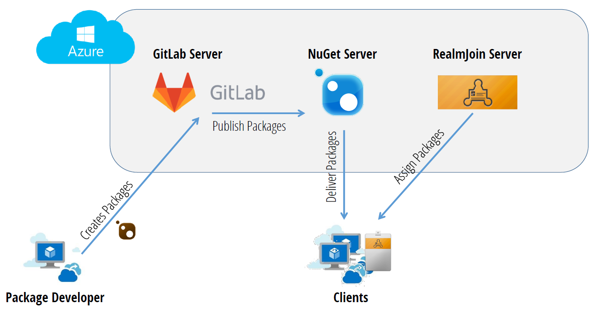
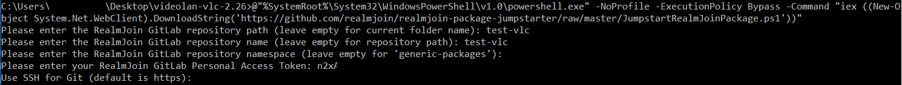
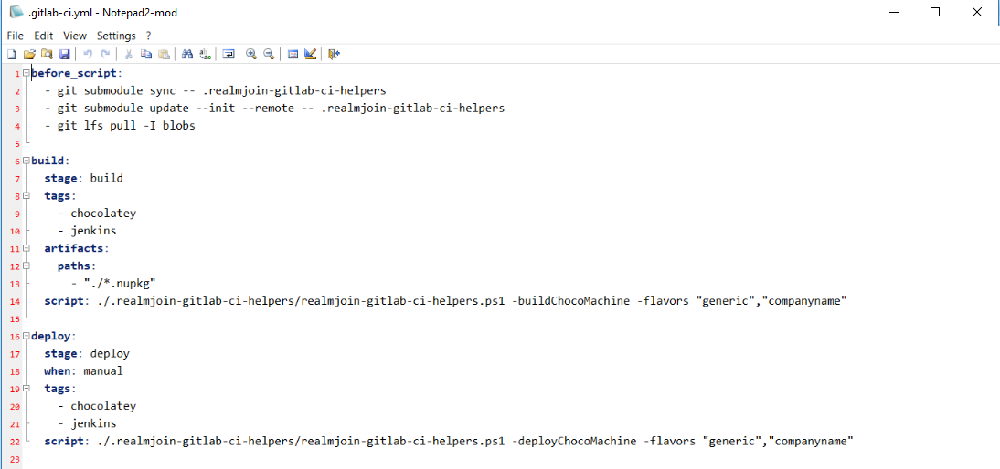
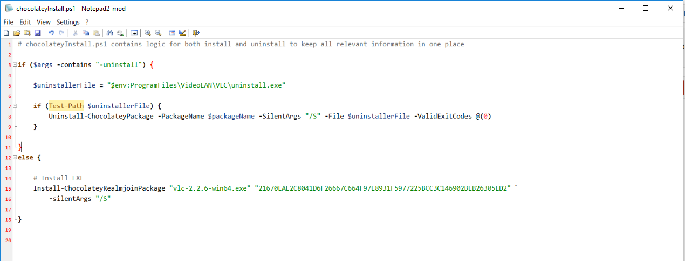

# Creating packages

  
The picture above provides a schematic overview over the RealmJoin package distribution ecosystem. The step of creating packages will be illuminiated in this chapter. 
It documents the basic steps in creating craft, chocolatey, APP-X and organic packages. While all types follow the same rough outline, there are some differences when handling the packages. 

## General Steps
This section describes the shared steps for craft and chocolatey packages. The packaging process will be demonstrated on the well known **VLC player**.

### Create local repository folder
Run cmd.exe as an administrator and navigate to the desired folder, in which the packages are to be created. Then create a new folder for the new repository:
```mkdir videolan-vlc-2.26```

### Use Jumpstarter to create repository
Gk provides a Jumpstarter script that can be used to automatically create the template for a new package. Run the following code in the bash shell: 

```
@"%SystemRoot%\System32\WindowsPowerShell\v1.0\powershell.exe" -NoProfile -ExecutionPolicy Bypass -Command "iex ((New-Object System.Net.WebClient).DownloadString('https://github.com/realmjoin/realmjoin-package-jumpstarter/raw/master/JumpstartRealmJoinPackage.ps1'))"
```
You confronted by the following prompt and asked to specify details:
```
* Please enter the RealmJoin GitLab repository path: test-vlc   
* Please enter the RealmJoin GitLab repository name: test-vlc   
* Please enter the RealmJoin GitLab repository namespace: (your namespace)   
* Please enter the RealmJoin GitLab Access Token: (your token)   
Cloning into....[installation messages]
``` 
  


After a short while, a new repository is created and the template files are copied into the local package folder. Before working on the files, please check the *readme.md*. Depending on the type of package that is to be created, the next steps will vary.  

<!--Run ```Jumpstart.ps1``` in powershell. -->

## Chocolatey Package
### Edit Package files
<!-- Depending on the instructions in the *readme.md* file, all not for choco packages used files can be deleted from the package folder including the ```Jumpstart.ps1```-->
* Create ```.gitlab-ci.yml```  
  Select and add the most fitting ```sample*.gitlab-ci.yml``` file and delete the other ones. In the following example, the *flavour* [companyname] was added, to provide the package with the desired corporate meta data. Remove the prefix of the filename and save it as ```.gitlab-ci.yml```.


  
* Customize ```choco-package.nuspec```  
  Add the metadata according to the desired software. 


* Move installer  
  Move the executables or installer files into the subfolder ```blobs``` and delete the placeholder file ```zzz_Place_installer_files_here_and_delete_me.txt```. 
* Customize ```tools\chocolateyInstall.ps1```  
  Based on the samples in the file, choose the most fitting one and adapt accordingly. 


* Customize `rj_install.cmd` and `rj_install.ps1` 
    * With User Settings
      * Customize one of `usersettings\rj_install.cmd` and `usersettings\rj_install.ps1`.
      * Delete `rj_install.cmd` and `rj_install.ps1` in root folder.
    * Without User Settings
      * Delete subfolder `usersettings` completely.
* Rewrite ```Readme.md```
  * Provide all information necessary in the ```Readme.md``` file.

<!--
* zzz_Run_to_init_and_add_submodule_then_delete_me.bat.
* rename sample... to .gitlab-ci.yml
* delete usersettings

### Add binaries into package

* Place binaries into ```blobs``` (add version into binary-name)
* create hash

### TBD

* edit tools/chocolateyInstall.ps1
* choose matching install hive
* set uninstall naming
* set install parameter
* set hash

### Optional: Dynamic Parameter
### git add, commit, push (git branch)

addfiles, deploy with parameter execution in crafts-->
## Craft Package
TBD
## Organic Package
TBD
## APP-X Package
TBD
## Conventions for all package types
### Capitalization and Naming
Please use only small letters for all naming purposes and use *vendor-program-version* as folder names.

### Version numbering
Software packages are assigned a individual version number. It is recommended to divide the version number into four parts W.X.Y.Z and use one of two different conventions:
  * For non-chocolatey packages GK is suggesting, to use *W* as major release number, *X* as majer sub-version, *Y* as minor release number and *Z* as (re-)packaging number (when rebuilding the package without changes in software but in the build itself). 
  * For chocolatey packages it is recommended to use the softwares version number, and use *Z* as (re-)packing number. If the software itself has a four part version number, chocolatey suggests to multiply the *Z* by 100 and increase the number by 1 every (re-)packaging.  
**Note:** When a new version is tested, the package might be crafted as a pre release package, which, if testing is successfull and no further changes have to be done, has the same version number as the final build.


 