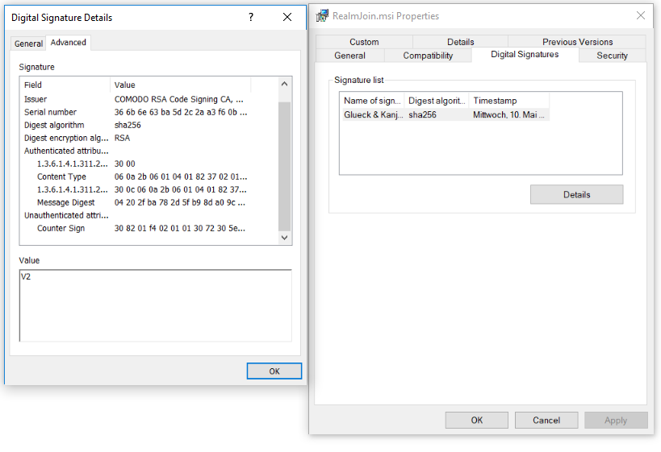

# Technical
## Requirements
### Environment 
RealmJoin is designed as a companion to Microsoft Intune to increase the usability in a 100% cloud environment with Microsoft Azure AD. The following pre-requirements are necessary:

* Microsoft Azure with Azure AD
* Windows 10
* Microsoft Intune 

### Hardware  
RealmJoin runs on every Windows 10 device. A Windows 10 certified device with TPM chip is recommended to ensure Bitlocker initialization. 

### Network

#### (No) Proxy
Initial deployment needs direct internet access. No proxy would be ideal, a transparent proxy should be ok (if really transparent). If there is a proxy unavoidable as a minimum requirement the following services/addresses need to be directly accessible (not recommended, list might not be exhaustive):  
  
For a list of the corresponding IP ranges please see 

[Microsoft Azure Datacenter IP Ranges](https://www.microsoft.com/en-us/download/details.aspx?id=41653)  
  
This file contains the compute IP address ranges (including SQL ranges) used by the Microsoft Azure Datacenters. A new xml file will be uploaded every Wednesday (Pacific Time) with the new planned IP address ranges. New IP address ranges will be effective on the following Monday (Pacific Time). Please download the new xml file and perform the necessary changes on your site before Monday.
  
[Office 365 URLs and IP address ranges](https://support.office.com/en-us/article/Office-365-URLs-and-IP-address-ranges-8548a211-3fe7-47cb-abb1-355ea5aa88a2)  

This article links a file that contains the compute IP address ranges that you should include in your outbound allow lists to ensure your computers can successfully use Office 365.
   
**WARNING:** IP addresses filtering alone is not a complete solution due to dependencies on internet based services such as Domain Name Services, Content Delivery Networks (CDNs), Certificate Revocation Lists, and other third party or dynamic services. These dependencies include dependencies on other Microsoft services such as the Azure Content Delivery Network and will result in network traces or firewall logs indicating connections to IP addresses owned by third parties or Microsoft but not listed on this page. These unlisted IP addresses, whether from third party or Microsoft owned CDN and DNS services are dynamically assigned and can change at any time.  
  
#### No (VLans/WLAN-/Port)-Isolation
For *BranchCache* to be effective the clients need to be able to communicate directly with each other. So they shouldn't be separated by different VLans, WLAN-Isolation or Port-Isolation. For mass rollouts "BranchCache Servers" with pre-populated caches are recommended. BranchCache is limited to a single subnet, if a site has multiple subnets the "BranchCache Servers" must be placed in the same subnet as the clients to be effective.  

## Infrastructure
### Frontend (Client)
The frontend component of RealmJoin is the RealmJoin client, which is installed on the Windows 10 device. With the installed RealmJoin client the individual user is able to access and install provided software in self service. Packages assigned as *required* by the administrator are installed automatically on the first Logon after assignment.  
Realmjoin is responsible for two different processes running on the device: 
* The *realmjoin.exe* process is started up automatically on Logon. The process is always running and sends upstream data (compare to chapter *Managing RealmJoin / States*) every 15 minutes. 
* The *realjoinservice.exe* is called when a package requires the *SYSTEM mode* to be processed. It is not running by default. 

There are three different version of the RealmJoin client available:  
* Stable - Stable release
* Beta - Near to stable, for long time testing
* Canaray - Experimental, first testing

<!--
### Update Cylces

### Ports/Traffic/ASTP exceptions-->

### BranchCache
A often encountered problem when providing software packages to a big number of devices in a WAN is creating a bottlenack and huge network loads when downloading software from a server to the devices. A solution for this problem is the *BranchCache* technologie.
There are two BranchCache modes, *hosted* and *distributed* cache. In hosted cache mode, the content is cached on one or more local *hosted cache servers*, which increases the network load, since a download from big binaries from an internet server is not necessary. 
RealmJoin uses BranchCache in the distributed cache mode:  
When a client device downloads software packages for the first time, the files are divided into chunks that are significantly smaller then the original content and cached on the device. If the same package is afterwards requested from a different client device in the same network, it downloads content information instead of the complete content from the server. The content information is used to locate the desired content on other devices in the network. If found, instead of downloading packages from the server, the content in form of the chopped up chunks, is transfered to the client device. If the requested software is available on a number of devices, the load is balanced between them. 
The RealmJoin Publishing Server has to provide the chunk identifiers, and therefore is hosted as a single Azure VM Windows 2016 IIS server with a Azure Blob Storage.  
For a more detailed documentation of the BranchCache technologie see the [Microsoft BranchCache documentation](https://technet.microsoft.com/de-de/library/hh831696.aspx).
<!-- Es gibt tonnenweise Doku im Netz zu BranchCache. Warum sind die relevanten Teile hier nicht zitiert bzw. referenziert??-->

#### Delivery Optimization for Windows Update
*Windows Update Delivery Optimization*, or *WUDO* is a self organised solution for distributed caches for Windows Updates. In default mode, WUDO identifies peers as part of a WAN based on their external IP. In case of streched out WANs with just one breakout point, this leads to a high network load and a bottleneck. 
To improve the handling, Microsoft Intune can be used to set WUDO to *download mode 2*, where peers are grouped by a groupID. The ID is set for each device using network fingerprinting and the MAC address of the default gateway and therefore creating a more localized group. RealmJoin is used to set the groupID for each client.

Two registry keys are updated when the *mode 2* delivery optimization is used:
Set Download Mode = 2
```
HKLM\SOFTWARE\Policies\Microsoft\Windows\DeliveryOptimization\DODownloadMode
```
Network-Fingerprint-GUID in Reg-Key:
```
HKLM\SOFTWARE\Policies\Microsoft\Windows\DeliveryOptimization\DOGroupId
```
If WUDO is activated on a device using BranchCache, WUDO is used for Windows Updates over WSUS with BranchCache.  
For a more on WUDO see the [Microsoft WUDO documentation (DE)](https://docs.microsoft.com/de-de/windows/deployment/update/waas-delivery-optimization).

### Backend
#### Hosting
The RealmJoin backend is an Azure web application using an Azure SQL data base and the available Azure services. 
The backend is hosted on a GK tenant, which is exclusively used for RealmJoin. All customer tenants are managed on this tenant, but are isolated from each other. 

#### RealmJoin App Publishing Endpoint
To provide the BranchCache mechanism (see section *BranchCache* above), the endpoint has to provide the chunk identifiers, a feature only provided by *Microsoft Internet Information Services* (IIS) servers. The Publishing Endpoint is hosted on a single Azure VM with Windows 2016 IIS and uses local storage. To increase scalability, it is currently planned to move the Publishing Endpoint to multiple Azure VM with Windows 2016 IIS that share one Azure blob storage. 

#### Web interface
The web interface can be reached via <https://realmjoin-web-staging.azurewebsites.net/> and is in detailed explained in the chapter *Managing RealmJoin*. After logging in with the provided credentials, the administrator can manage the package distribution in his tenant and has access to extensive information.

## Security Features
### Client authentication
The RealmJoin client authenticates itself against the Azure AD via a secured HTTPS connection, receiving a identification token. With the token the client now is able to proof its identity to the Microsoft Graph API and the RealmJoin backend. After identifying the client, the backends response to the client is RSA signed. Using the servers public key, the RealmJoin client and service are able to verify the identity of the backend server response.

### Signed MSI 
The RealmJoin.MSI is SHA2 (256 bit) signed by GK and therefore recognizied by Windows as safe to install.

  

### Package Hashes
During the package creation process, packages are signed with SHA2 (256 bit) hashes (see chapter *create packages*). Older SHA1 signed packages will still be accepted by RealmJoin. For more information on SHA2 encryption, check [the Wikipedia article on SHA2](https://en.wikipedia.org/wiki/SHA-2).

### Bitlocker
#### Bitlocker enforcement
It is possible to force Bitlocker encryption for OS volumes. The configuration file (see chapter *Policies*) allows to set the switch *BitlockerEnabled* to true. If the device is equipped with a *ready state* TPM chip the encryption is activated. To allow the Bitlocker enforcement, the registry key ```HKLM\SYSTEM\CurrentControlSet\Control\BitLocker:PreventDeviceEncryption``` is set to false. 
For virtual machines the encryption is only enforced, if the virtual machine variable ```$env:RjDisableVmDetection=1``` is set. 

#### Bitlocker recovery key
If the client device is Azure AD joined, RealmJoin uploads the Bitlocker recovery key to Azure AD. If the upload is not successfull in the first try, it will be retried. If the upload can not be performed successfully, the RealmJoin rollout failed. 
In case of a *not-AAD-joined* device, the Bitlocker recovery key is not secured. 
### Passwort expiry
RealmJoin uses the Azure AD attribute ```msDS-UserPasswordExpiryTimeComputed``` to check if the user passwort is expired. 
