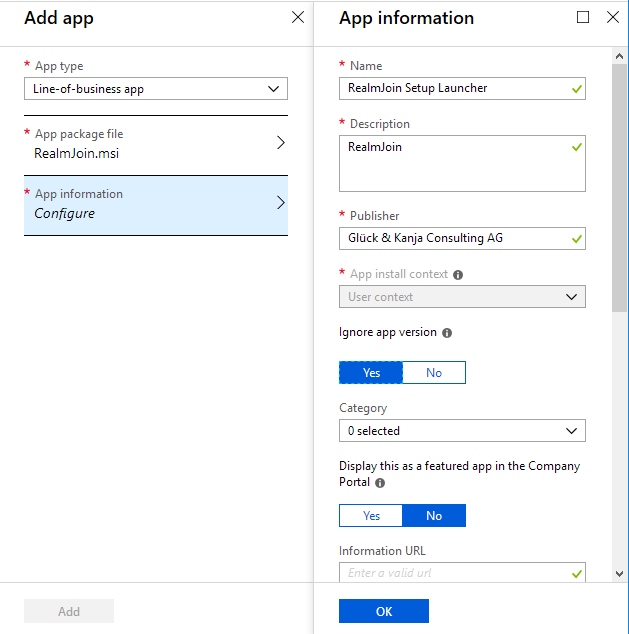

# Installation

RealmJoin can be deployed on a device using one of multiple ways, depending on the individual scenario. As a first step, download the RealmJoin installer of your choice and procede to the desired installation method.
## Download RealmJoin Client 
### Release 
[RealmJoin Release Version](https://gkrealmjoin.s3.amazonaws.com/win-release/RealmJoin.msi)
### Beta Channel 
[RealmJoin Beta Version](https://gkrealmjoin.s3.amazonaws.com/win-beta/RealmJoin.msi)
### Canary Channel 
[RealmJoin Canary Version](https://gkrealmjoin.s3.amazonaws.com/win-canary/RealmJoin.msi)

## Via Microsoft Intune
Currently, it is only possible to deploy RealmJoin through Microsoft Intune by deploying the MSI as a Line-of-Business app. The deployment through an Intune PowerShell script is not supported as the MSI installer will then be unable to launch the RealmJoin tray in the logged-in user's context at the end of the installation.

### Azure Intune Portal
The deployment of RealmJoin using Azure Intune requires only the .MSI installer to be configured. If the RealmJoin app in the desired release version is not registered in Intune, it can be added as a Line-of-Business app via the Azure Portal blade *Microsoft Intune / Mobile Apps / Apps / Add*.  
  
  
  
In the configuration tab basic and advanced information can be provided.   
  
  
  
Like any other application in Intune, ReamJoin then can be assigned to the desired user groups as (required) software. It is not neccessary to install additional software on the client devices to run RealmJoin. RealmJoin will be deployed on the client devices on next Azure sync.

### Windows Defender Exceptions
RealmJoin might be recognized by the *Windows Defender* as a possible thread. While this behaviour is not certain, it is recommended to implement some Windows Defender exceptions. Create a new device configuration profile, type *Device restriction*, or edit your existing profile and add the following *Windows Defender Antivirus Exceptions*:  
* Files and folders  
    * `%ProgramFiles%\RealmJoin`  
* Processes   
    * `%ProgramFiles%\RealmJoin\RealmJoin.exe`    
    * `%ProgramFiles%\RealmJoin\RealmJoinService.exe`    
    * `%ProgramFiles%\RealmJoin\RealmJoinUpdate.exe`    

## Interactive Installation
If an administrator wants to install RealmJoin on a device without mass deployment or the Microsoft Intune infrastructure, he/she may download the MSI and do an interactive installation or copy one of the command lines below to download and run in a single step.

## Command Line Installation
You may download and install RealmJoin in a single step by using the following command lines. This may help especially when testing scenarios or new software packages in virtual machines.

### Release Channel 
```
@powershell -NoProfile -ExecutionPolicy unrestricted -Command "((new-object net.webclient).DownloadFile('https://gkrealmjoin.s3.amazonaws.com /win-release/RealmJoin.exe', 'realmjoin.exe'))" && .\realmjoin.exe
```
### Beta Channel 
```
@powershell -NoProfile -ExecutionPolicy unrestricted -Command "((new-object net.webclient).DownloadFile('https://gkrealmjoin.s3.amazonaws.com
/win-beta/RealmJoin.exe', 'realmjoin.exe'))" && .\realmjoin.exe
```
### Canary Version
```
@powershell -NoProfile -ExecutionPolicy unrestricted -Command "((new-object net.webclient).DownloadFile('https://gkrealmjoin.s3.amazonaws.com
/win-canary/RealmJoin.exe', 'realmjoin.exe'))" && .\realmjoin.exe
```

### Silent Installation
When installing RealmJoin during unattend OS installation or any other non-interactive deployment method you may favour not to have any UI interaction during installation. To install RealmJoin in such a scenario use the silent installation option:

```
reamjoin.exe -install
```

