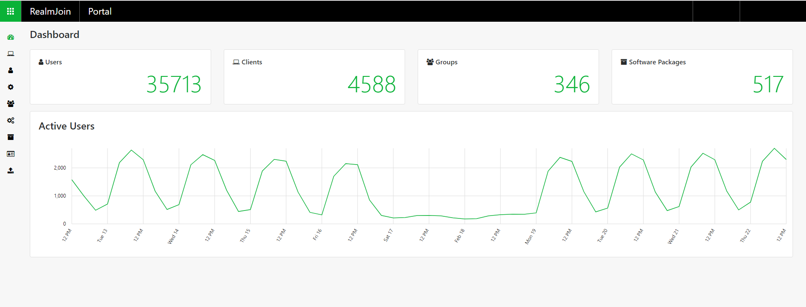
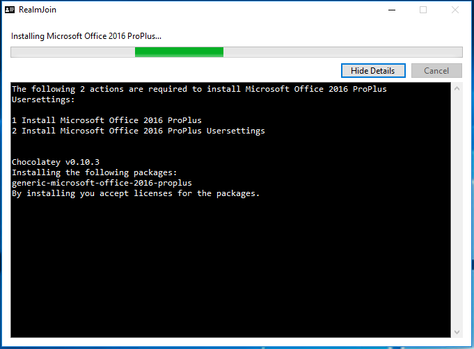

# Managing RealmJoin
Administrative users have access to the RealmJoin administrator console. As RealmJoin is highly compatible with Microsoft Intune and Microsoft Azure, it incorporates the same group based user and policy management experience and uses the Azure AD defined groups as basis for software deployment. The default interval for group synchronization between Azure AD and RealmJoin is 15 minutes, while only groups with a defined prefix are taken into consideration. Only groups with at least one assigned user are syncronized, and the syncronization interval can be adjusted.

## User Client
The RealmJoin client is enrolled on evey Windows 10 device. RealmJoin seamlessly fits into the modern workplace with its focus on user self-service and mobility. Using the RealmJoin client module, the user may install provided software, get basic information on the device and membership in the tenant domain wihout the need of contact an IT administrative. 

### Initial Start
When RealmJoin is enrolled and started for the first time, it asks for the User-Identity and then calls to the cloud Service for a policy.  
   
  

RealmJoin “Security Requirement” assessment does some pre-checks (Encryption, Patch Level, Firewall, Anti-Virus, etc. – this is optional and can be replaced in parts by Intune-Health-Check).  
  

  
If no error ocurs during deployment, RealmJoin is ready to use.

### Client usage
After being successfully installed, RealmJoin is automatically started on the user login and is permanent active in the background. It is represented with an ID card icon. Clicking on the icon opens up the RealmJoin client menu. It contains basic information in the lower and a number of links in the upper part. The selector *Software Packages* opens a second context menu with all the software packages that are allocated to the user.
  
   
  
If a user wishes to install any of the listed software, he/she is only required to select the package to start the installation. 
  
  
  
The installation mode depends on the packages selected: If those are only user mode packages, they are installed immediately. In case of a higher permission level, RealmJoin starts a service (realmjoinservice.exe) and installs the packages with the *SYSTEM* user account.

### Debug Modus
If neccessary, a debug window can be opened by clicking on the RealmJoin icon while pressing Shift+Strg on the keyboard. This reveals a new entry in the context menu listed as *Show Debug Window*. This window offers seven different diagnostic tools. If a device is not able to be addressed by the server or can not connect to the backend, this tool will provide the user with the tools for the first steps of diagnosis. Another new tray menu entry showing up in debug mode is *Retry base installation*, which allows the user to reinstall the RealmJoin client. Additionally, when the client tray menu is opened in debug mode, all packages are shown with the package version number.

  

*Collect Logs* is a quick way to access all log files, which will be saved in a zip-file to the users desktop. See chapter *troubleshooting* for a detailed description of the RealmJoin debug window and its features.

## Admin Console
Device provisioning and RealmJoin configuration is done with the RealmJoin *Admin Console*. Designed to mirror the style of the new Microsoft administration services, it is the main tool for the management of the RealmJoin clients and users. The web application can be reached under <https://realmjoin-web-staging.azurewebsites.net/>.

  

The dashboard provides a quick and beneficial overview. All sections can be accessed by either clicking on the corresponding number or selecting the section in the toolbar on the left.

### Clients
  
The clients tab gives you a transparent overview over all enrolled devices as well as the respective primary user. To enter the devices' states (see section *States*) or associate users, just click on the green numbers on the right. 
 
### Users
  
 A list of all users assigned to the tenant. The selectable details on the right include states, group membership, installed software packages, client devices and (to come...) individual settings. Users can't be added or assigned to groups using RealmJoin, the management of users and groups has to be done in Azure AD. 
Selecting a user opens up the users detail page, which contains information gathered by RealmJoin using the Microsoft Graph API.

### User settings
  
Configurable group settings and policies. See chapter *Policies* for a list of implemented features.

### Groups
  
All in this tenant registered user groups. RealmJoin syncronizes groups from Azure Active Directory into the RealmJoin backend. The details on the right contain users within the individual group, packages that are assigned to a group as well as group settings. Since not all users in Azure AD might be equipped with RealmJoin, only a specified range of groups are transfered into RealmJoin (depending on the group name.....). The groups can not be added or altered within RealmJoin, therefore the group naming conventions have to be established in advance.
   
While there are not strict naming pattern requirements in RealmJoin, we recommend the following convention:
  
```
*APP|CFG - Location-[Vendor-Product-Language-Type-Flavor]*  
```

**Examples:**  
```
CFG - Global-Core  
CFG - DE-Core  
CFG - DE7499-Core  
APP - Adobe-Photoshop  
APP - Microsoft-Visio  
APP - Mozilla-Firefox  
APP - Mozilla-Firefox-PreRelease  
APP - Mozilla-Firefox-Optional  
APP - Mozilla-Firefox-Optional-PreRelease  
APP - Mozilla-Firefox-x86  
APP - Mozilla-Firefox-x64  
APP - Mozilla-Firefox-DE7499  
APP - Mozilla-Firefox-withFlash  
```
  
The standard sychronization time is 20 minutes (hh:00, hh:20, hh:40), and all groups that start with *APP - * or *CFG - * are taking into consideration.  
The synchronization time schedule and the prefixes that are taken into account can be adjusted, currently only on request.

### User settings
  
Configurable group settings and policies. See chapter *Policies* for a list of implemented features.

### Software Packages
  
A list of all added packages. 
The detail list contains the package version, install order, auto upgradibility and user/group assignment. 

#### Add packages
The administrator is able to add created craft and choco packages to RealmJoin using the *Add Choco* / *Add Craft* buttons. This open the package setup window.    
  
   
  
There are two ways to add the neccessary information: Entering the required fields *Name*, *Version*, *Chocolatey Package ID* (Chocolatey packages only), *ID* (*Chocolatey Package ID* and *ID* are usually similar), *Location*, *Hash* and *Scope* (all three craft packages only) manually or pasting the JSON code, which can be found in the corresponding package repository (pipeline).  
  
  
  

While adding a package the following configuration entries are available:  
- Name  
  * The *name* under which the package is listed in the client and RealmJoin admin console. Otherwise not used as an unique identifier.
- GroupName  
  * An optional group name may be entered. This name has no connection to the user groups, instead it will be shown in the RealmJoin client context menu to group the depicted applications.
- ID  
  * The RealmJoin internal name of the package, for example *generic-videolan-vlc*.
- DependsOn
  * The *DependsOn* option is used to indicate if a package needs another package to be installed to work properly. This may be the case for Office user setting packages, that require an office installation upfront. It is possible to hide packages, so that the client context menu only shows one installation option (see section *Package Assignment*), but all involved packages have to be assigned to the user group for dependencies to work.  
  For a working correlation, the correct package name has to be provided. 
     If there is a multiple level-dependency, RealmJoin takes this into consideration. Before the installation process, all dependency-related packages are sorted (also including mandatories) and installed afterwards. The following images show the assignment of package dependency for the chocolatey package *Microsoft Office 2016 ProPlus*, which will be installed with usersettings:   
       
        
       
     The user setting package *Microsoft Office 2016 ProPlus ML UserSettings* is assigned as usual, with the ID of the parent package *generic-microsoft-office-2016-proplus* entered as *DependsOn*. During the installation process in the RealmJoin client, RealmJoin understands the need of the *generic-microsoft-office-2016-proplus* package and installs the deployed version of it first.   
       
       
    RealmJoin takes 1:n dependenciey into account. It is possible to add more than one dependency using the synthax:  
     ``["package-id-1","package-id-2"]``    
- Order
  * The order number is an Int32 type figure and provides RealmJoin with a basic structure to determine the package installation sequence. The lower the number the higher the importance, therefore a 10 will be installed before 100. 
    It has to be noted that a 0 is translated to "no sequence given" and the order number is only taken into account at the first roll out.
- Args
  * If the packaged software has to be installed with arguments. If the package to be deployed is a chocolatey package, make sure to use the prefix *-params* and correct escaping, since chocolatey might mistake the arguments to be directed to it.
    It has to be noted, that it is also possible to provide arguments in the package assignment stage (see section below). Globally relevant parameters (e.g. volume license number) should be provided at the package addition step, while more individualized arguments (e.g. language packs) are better specified during the assignment step.
- Version
  * Version of the package to be installed (for conventions of the version numbering see chapter *Packages*).
- Chocolatey Package ID (chocolatey packages only)
  * Exact chocolatey repository name of the package to be installed. The combination of name and version is used ensure that the correct package is installed. Usually similar to the internal RealmJoin *ID*.
- Location (craft only)
  * Location of the package on the backend. 
- Hash (craft only)
  * Hash of the package
- Scope
  * Craft packages might be installed in the *user* or *system* scope.
Options:  
- Availability
  * *Allow Reinstall*: This option allows the client user to reinstall and therefore override their current installation of the package. Useful for information that is taken from Azure or similiar. 
  * *Pre-Release*: The pre-release flag as two distintive features within RealmJoin. It allows a) to add a package with ID and version similar to another existing package in the portal and b), if assigned to a group or user, overwrites all other packages with the same ID assigned to the group or user.  
  Those features are usually used for the testing of new packages or updates of existing one: The test-groups or test-users get the pre-release version of a package assigned during the testing.  
  *Note*: Under normal circumstance it is highly adviced to prevent a normal user having the same package assigned more than once.   
  The pre-release flagged package is visually highlighted in the portal's package list with an lightning symbol behind the name.  
  - Auto Upgrade
  * The *Auto Upgrade* feature may be enabled to automatically update the package if a new version is assigned in RealmJoin. If not choosen, the user has to manually select the package to be upgraded.
- Staggered Deployment
  * It is possible to use staggered deployment and distribute the risk of updating a software if desired. The two parameters needed are the target date and the amount of days over which the update should take place. 
    The clients are not equaly distributed in the deplyoment groups, with fewer deployments in the first part of the timeline and the majority on the last. 
    Deployed package versions for each can be found in the user details of the package or the deployed package details of the users.
    Exsample distribution for n = 10000 and 8 days update time:   
      
       

**NOTE:** Do not edit assigned packages in the way, that you change the package name or ID (version number is fine). If you need a package in a different flavour, please add a new package and delete the obsolete one.  
#### Assign Packages

Similar to the profile management with Microsoft Azure AD, packages can be assigned to groups and individual users. To assign a package, enter the group or user detail for the package in the package control panel. 
There are four options to override the package configuration when assigning, if in conflict with the package settings, the assignment settings override: 
- Availabilty
  * Packages can be labeled as *mandatory* to make the software package non-optional.
  * Packages might also be labeled as *hidden*, making them invisible in the RealmJoin client context menu. This might be used for mandatory software or for multiple level dependencies, when the user should only be able to install the highest hierachie and the underlying packages should be installed automatically.  
- Auto Upgrade
  * In addition to the configuration of the package itself (see section above for the feature description), *auto upgrade* can be enabled for the selected group / user individually. 
- Staggered Deployment
  * In addition to the configuration of the package itself (see section above for the feature description), *stagered deployment* can be enabled for the selected group / user individually. 
- Args
  * In addition to the configuration of the package itself (see section above for the feature description), *Args* can be set for the selected group / user individually.   
    
    

### States
   
The *states* detail of the client or user control panel provides a list of the devices of the user and how frequent data was upstreamed. 
The *Branch Cache* column indicates, how much this client has contributed to the package distribution over the *Branch Cache* feature (see chapter *Infrastructure*).
Selecting the white arrow in the green circle gives away the complete upstream file.
It contains all the information about the device, OS, Defender Pattern States and installed packages that are transfered to the backend, where some of it is evaluated.   
  
  

It is possible to extend the states by custom states. See [Custom States](#customstates) for details. 
### Settings
#### List of states

##### Information on the Windows Device: 

```
{
  "Type": "win",
  "ClientID": "75cf4d56-0676-ae02-73ad-a1af9b89f269",
  "VersionTray": "4.9.15-canary+14869.bf207295",
  "VersionService": "4.9.15-canary+14869.bf207295",
  "OperatingSystem": {
    "Name": "Windows 10 Enterprise",
    "Edition": "Enterprise",
    "CompositionEdition": "Enterprise",
    "Version": "10.0.14393.0",
    "ReleaseID": "1607",
    "BuildBranch": "rs1_release",
    "Build": 14393,
    "BuildRevision": 0,
    "InstallDate": "2017-08-16T12:53:01Z",
    "Bits": 64,
    "Activated": false
  },
  "MachineName": "DESKTOP-VH66R7X",
  "DomainName": "LEGACYDOMAIN",
  "JoinedDomainName": "legacydomain.local",
  "HostName": "DESKTOP-VH66R7X",
  "Timestamp": "2017-09-14T07:07:39.2543111+00:00",
  "User": {
    "LocalName": "JONDOE",
    "LocalLogonAt": "2017-09-14T07:07:06.3167385+00:00",
    "IsAdministrator": false
  },
  "Firewall": {
    "ProfileStates": [
      "ON",
      "ON",
      "ON"
    ]
  },
  "AvProducts": {
    "Installed": [
      {
        "Name": "Windows Defender",
        "State": 397568,
        "Details": {
          "AMEngineVersion": "1.1.14003.0",
          "AMProductVersion": "4.10.14393.0",
          "AMServiceEnabled": true,
          "AMServiceVersion": "4.10.14393.0",
          "AntispywareEnabled": true,
          "AntispywareSignatureAge": 29,
          "AntispywareSignatureLastUpdated": "2017-08-15T14:37:45+00:00",
          "AntispywareSignatureVersion": "1.249.1077.0",
          "AntivirusEnabled": true,
          "AntivirusSignatureAge": 29,
          "AntivirusSignatureLastUpdated": "2017-08-15T14:37:46+00:00",
          "AntivirusSignatureVersion": "1.249.1077.0",
          "BehaviorMonitorEnabled": true,
          "ComputerID": "829DE85B-7B39-4093-85F1-6AEF62AC65DD",
          "ComputerState": 0,
          "FullScanAge": 4294967295,
          "FullScanEndTime": null,
          "FullScanStartTime": null,
          "IoavProtectionEnabled": true,
          "LastFullScanSource": 0,
          "LastQuickScanSource": 0,
          "NISEnabled": true,
          "NISEngineVersion": "2.1.13804.0",
          "NISSignatureAge": 0,
          "NISSignatureLastUpdated": "2017-09-14T07:06:25.604+00:00",
          "NISSignatureVersion": "117.8.0.0",
          "OnAccessProtectionEnabled": true,
          "QuickScanAge": 4294967295,
          "QuickScanEndTime": null,
          "QuickScanStartTime": null,
          "RealTimeProtectionEnabled": true,
          "RealTimeScanDirection": 0,
          "PSComputerName": null
        }
      }
    ]
  },
  "Bitlocker": {
    "DriveStates": [
      {
        "ComputerName": "DESKTOP-VH66R7X",
        "MountPoint": "C:",
        "EncryptionMethod": 0,
        "AutoUnlockEnabled": null,
        "AutoUnlockKeyStored": null,
        "MetadataVersion": 0,
        "VolumeStatus": 0,
        "ProtectionStatus": 0,
        "LockStatus": 0,
        "EncryptionPercentage": 0,
        "WipePercentage": 0,
        "VolumeType": 0,
        "CapacityGB": 59.50976,
        "KeyProtector": []
      }
    ]
  },
  "OsUpdates": {
    "RefreshTime": "2017-08-16T14:38:44.1388364+00:00",
    "PendingUpdates": {},
    "Settings": {
      "DeferQualityUpdates": 1,
      "DeferQualityUpdatesPeriodInDays": 21,
      "BranchReadinessLevel": 32,
      "DeferFeatureUpdates": 1,
      "DeferFeatureUpdatesPeriodInDays": 60
    }
  },
  "BranchCache": {
    "DataCacheCurrentActiveCacheSize": 1424903614,
    "CurrentClientMode": "DistributedCache"
  },
  "Chocolatey": {
    "RequiredVersion": "0.10.3",
    "InstalledVersion": "0.10.3",
    "Status": "Ready"
  },
  "SoftwarePackages": {
    "Installed": [
      {
        "ID": "chocolatey",
        "Version": "0.10.3",
        "ArgsHash": null
      },
      {
        "ID": "realmjoin-core.extension",
        "Version": "1.0.0.0",
        "ArgsHash": null
      },
      {
        "ID": "contoso-adobe-reader-dc-classic",
        "Version": "15.6.30306.0",
        "ArgsHash": null
      },
      {
        "ID": "contoso-fonts",
        "Version": "1.0.0.5",
        "ArgsHash": null
      },
      {
        "ID": "contoso-microsoft-office-2016-proplus-x64-en-de",
        "Version": "16.0.2.0",
        "ArgsHash": null
      },
      {
        "ID": "contoso-office-templates-de",
        "Version": "3.0.1.0",
        "ArgsHash": null
      }
    ]
    "Inventory": [
      {
        "Name": "7-Zip 18.01 (x64 edition)",
        "Version": "18.01.00.0",
        "Publisher": "Igor Pavlov",
        "EstimatedSize": 5123,
        "UserScope": false
      },
      {
        "Name": "Adobe Acrobat Reader DC (2015) MUI",
        "Version": "15.006.30417",
        "Publisher": "Adobe Systems Incorporated",
        "EstimatedSize": 552266,
        "UserScope": false
      },
      {
        "Name": "Chocolatey GUI",
        "Version": "0.16.0.0",
        "Publisher": "Chocolatey",
        "EstimatedSize": 43896,
        "UserScope": false
      },
      {
        "Name": "Dropbox",
        "Version": "44.4.58",
        "Publisher": "Dropbox, Inc.",
        "EstimatedSize": 0,
        "UserScope": false
      }
    ]
  },
  "DeliveryOptimization": {
    "DefaultGatewayDiscovered": null,
    "GroupID": "00000099-0000-0000-0000-002cc8f1c3bd"
  }, 
  "Atp": {
    "IsOnboarded": true,
    "OnboardingInfo": {
      "previousOrgIds": [],
      "orgId": "fa29db65-000c-0000-9459-369df149b5ba",
      "geoLocationUrl": "https://winatp-gw-weu.microsoft.com/",
      "datacenter": "WestEurope",
      "vortexGeoLocation": "EU",
      "version": "1.13"
    }
  }
}
```

### Package upload 
  
To request new packages to be provided by G&K, use the uploader in the RealmJoin admin console. Please provide the necessary binaries as well as all installation requirements and additional information as a *Readme.txt*. After submitting the information (please do not forget a contact person!), you will be able to upload your zip file containing the binaries and the additional information. This will trigger a packaging request in the G&K ticketing system.   
  
 
   
<!--
# TBD  
Roles and self service in the admin console.
Roles werden noch eingeführt, aktuell nur Admin oder kein Admin
### Increased self service
SelfService im Backend/Admin Console geplant, niedrige Prio -->
