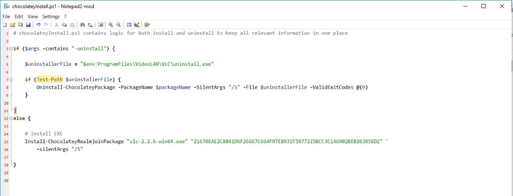
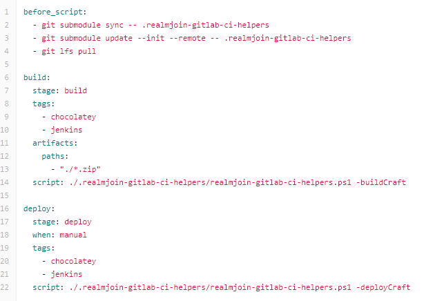
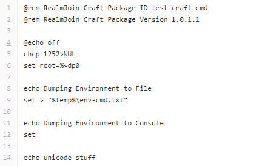
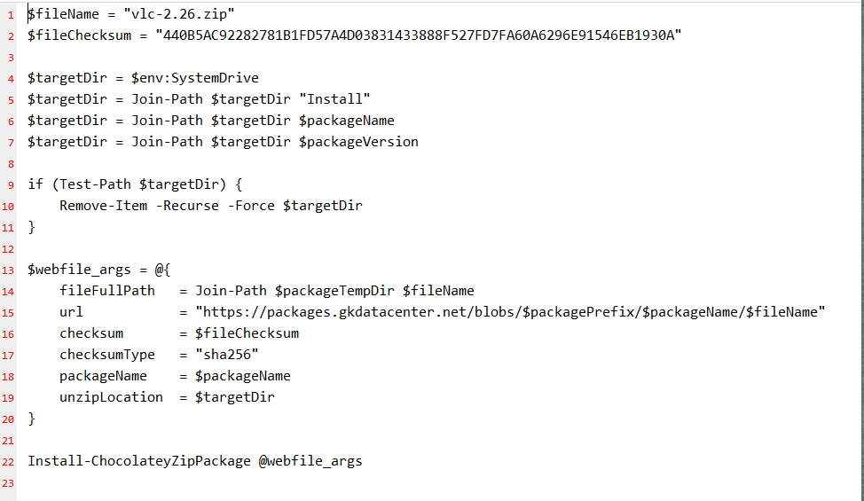

# Workflow (internal GK)

## First: Upload through customer  
The customer uses the *RealmJoin Organic Uploader* <https://realmjoin-uploader.azurewebsites.net/> to upload a * .zip file containing the .msi or .exe file as well as the instructions on the desired installation mode.

## Second: Get involved  
The customers upload triggers an automatic ticket in the GK ticketing system. Find the relevant upload ticket and assign it to yourself. The ticket may contain the *UUID* which is needed to identify the upload in the BLOB storage. 
**NOTE:** Currently it is not possible to track the upladed zip - file into the BLOB storage, resulting in a missing *UUID*. Therefore, it is currently neccessary to remember the timestamp of the ticket.

## Third: Find the file  

Use the *Microsoft Azure Storage Explorer* (install using RealmJoin if it not already done so) to find the upload corresponding to the *UUID* of the ticket or timestamp of the ticket. 
Due to different time zones, the hour in the tickets timestamp and the *MASE* timestamp may be deviate. If several blobs have the same timestamp or are too close, check their properties (right click) for the original filename. 
Save the file to your working directory. You might remove the upload in the storage after succesfully enrolling the package.

## Fourth: Check the requierments 

Before building your package, there are different checks to be performed:

1. Did the customer provide all information that is needed to create the package: EXE / MSI? Readme with installation requirements? ...? 
  + If not, get in touch with the customer to clarify the required information.
2. Is this package neccessary:
  * Check if the package already exists. If so: Same software version and parameters?
  * If the requested software exists in a different version: Might an update be more reasonable? Are different version required due to features or similar? 
  + Get in touch with the customer to discuss and clarify the need for a additional version of this package.
3. Is this package generic:
  * **ALWAYS TRY TO GO GENERIC** This will make maintaining and updating a lot easier, plus you may reuse the package for different users later on.
  * Does the customer request parameter or arguments that prevent the package to be used as a generic package? 
  * If so, check if those are really neccessary: How is the software installed? Instead of reg keys, is it possible to use installation parameters in the package assigning step to configure the software?
    Why do the customer need this configuration and not the generic package?
  + Get in touch with the customer, if neccessay and try to make the package generic.

**Do not start creating the package before you have a reasonable assumption of what to pack**

## Fifth: Create the package
### General Steps
This section describes the shared steps for craft and chocolatey packages. The packaging process will be demonstrated on the well known **VLC player**.

### Create local repository folder
Run cmd.exe as administrator and navigate to the desired folder, in which the packages are to be created. Then create a new folder for the new repository:
```mkdir videolan-vlc-2.26```

#### Use Jumpstarter to create repository
Gk provides a Jumpstarter script that can be used to automatically create the template for a new package. Run the following code in the bash shell: 

```
@"%SystemRoot%\System32\WindowsPowerShell\v1.0\powershell.exe" -NoProfile -ExecutionPolicy Bypass -Command "iex ((New-Object System.Net.WebClient).DownloadString('https://github.com/realmjoin/realmjoin-package-jumpstarter/raw/master/JumpstartRealmJoinPackage.ps1'))"
```
You confronted by the following prompt and asked to specify details:
```
* Please enter the RealmJoin GitLab repository path: test-vlc   
* Please enter the RealmJoin GitLab repository name: test-vlc   
* Please enter the RealmJoin GitLab repository namespace: (your namespace)   
* Please enter the RealmJoin GitLab Access Token: (your token)   
Cloning into....[installation messages]
``` 
  

After a short while, a new repository is created and the template files are copied into the local package folder. Before working on the files, please check the *readme.md*. Depending on the type of package that is to be created, the next steps will vary.  

<!--Run ```Jumpstart.ps1``` in powershell. -->

### Chocolatey Package
#### Edit Package files
<!-- Depending on the instructions in the *readme.md* file, all not for choco packages used files can be deleted from the package folder including the ```Jumpstart.ps1```-->
* Create ```.gitlab-ci.yml```  
  Select and add the most fitting ```sample*.gitlab-ci.yml``` file and delete the other ones. In the following example, the *flavour* [companyname] was added, to provide the package with the desired corporate meta data. **NOTE:** make sure to provide the *-build / -deployChocoMachine* parameters for Chocolatey packages. Remove the prefix of the filename and save it as ```.gitlab-ci.yml```.  
  
* Customize ```choco-package.nuspec```  
  Add the metadata according to the desired software. 
 
* Move installer  
  Move the executables or installer files into the subfolder ```blobs```.
* Create SHA256 hash  
  Open a Powershell and navigate into the ```blobs``` subfolder. Execute 
  ```
  Get-ChildItem | % {(Get-FileHash $_.name).hash + " *" + $_.name | out-file ($_.name + ".sha256")}
  ```
  A `*.sha256` file is created for every item in the folder. The command is also listed in the placeholder file ```zzz_Place_installer_files_here_and_delete_me.txt```, which is to be deleted afterwards (as well as any ```zzz_Place_installer_files_here_and_delete_me.txt.sha256``` item).  
* Customize ```tools\chocolateyInstall.ps1```  
  Based on the samples in the file, choose the most fitting one and adapt accordingly. 
 
* Customize `rj_install.cmd` and `rj_install.ps1` 
    * With User Settings
      * Customize one of `usersettings\rj_install.cmd` and `usersettings\rj_install.ps1`, if necessary, and delete the other one. This file may contain various modifications and adjustments, e.g. registry keys or (un-)pinning of start icons.
      * Delete `rj_install.cmd` and `rj_install.ps1` in root folder.
    * Without User Settings
      * Delete subfolder `usersettings` completely.
      * Customize one of `rj_install.cmd` and `rj_install.ps1` in root folder, if necessary, delete the other one.
* Rewrite ```Readme.md```  
  Provide all information necessary in the ```Readme.md``` file.
* Upload  
  Commit the file and upload it with Git to the Gitlab.  
<!-- ### Optional: Dynamic Parameter ### git add, commit, push (git branch) addfiles, deploy with parameter execution in crafts -->  
### Craft Package
#### Edit Package files
* Delete non-craft items  
  Delete subfolders `blobs`, `tools` and `usersettings` and file `choco-package.nuspec`.
* Create ```.gitlab-ci.yml```  
  Select and add the most fitting ```sample*.gitlab-ci.yml``` file and delete the other ones. In the following example, the *flavour* [companyname] was added, to provide the package with the desired corporate meta data. **NOTE:** make sure to provide the *-build / -deployCraft* parameters for craft packages. Remove the prefix of the filename and save it as ```.gitlab-ci.yml```.  
  
* Customize `rj_install.cmd` and `rj_install.ps1`  
  Customize one of `rj_install.cmd` and `rj_install.ps1` in root folder, if necessary, delete the other one. This file may contain various modifications and adjustments, e.g. registry keys or (un-)pinning of start icons.  
 
* Any additional files can also go into the root folder.
* Rewrite ```Readme.md```  
  Provide all information necessary in the ```Readme.md``` file.  
* Upload  
  Commit the file and upload it with Git to the Gitlab.

### Organic Package  
Organic packages are created similar to Chocolatey packages, but instead of a software install, they unzip a specified file into a specified folder on the device. Therefore, the main differences are the provided `blobs` and the `chocolateyInstall.ps1`script. 
* Create ```.gitlab-ci.yml```  
  Select and add the most fitting ```sample*.gitlab-ci.yml``` file and delete the other ones. In the following example, the *flavour* [companyname] was added, to provide the package with the desired corporate meta data. **NOTE:** make sure to provide the *-build / -deployChocoMachine* parameters for organic packages. Remove the prefix of the filename and save it as ```.gitlab-ci.yml```.
  
* Customize ```choco-package.nuspec```  
  Add the metadata according to the desired software. 
 
* Move `*.zip`  
  Zip the files that should be delivered onto the devices. Move the executables or installer files into the subfolder ```blobs```.
* Create SHA256 hash  
  Open a Powershell and navigate into the ```blobs``` subfolder. Execute ```Get-ChildItem | % {(Get-FileHash $_.name).hash + " *" + $_.name | out-file ($_.name + ".sha256")}```. A `*.sha256` file is created for every item in the folder. The command is also listed in the placeholder file ```zzz_Place_installer_files_here_and_delete_me.txt```, which is to be deleted afterwards (as well as any ```zzz_Place_installer_files_here_and_delete_me.txt.sha256``` item).  
* Customize ```tools\chocolateyInstall.ps1```  
  Specify the desired `$targetDir` location on the device and the correct `$filename` of the zip container.  
 
* Delete `rj_install.cmd` and `rj_install.ps1`  
   * Delete subfolder `usersettings` completely.
   * Delete `rj_install.cmd` and `rj_install.ps1` in root folder.
* Rewrite ```Readme.md```  
  Provide all information necessary in the ```Readme.md``` file.
* Upload   
  Commit the file and upload it with Git to the Gitlab.
  
### APP-X Package
TBD
### Conventions and helpers
#### realmjoin-gitlab-ci-helpers.ps1
The `realmjoin-gitlab-ci-helpers.ps1` is a helper script called in all package types in the `.gitlab-ci.yml`, e.g. `script: ./.realmjoin-gitlab-ci-helpers/realmjoin-gitlab-ci-helpers.ps1 -buildChocoMachine -flavors "generic","glueckkanja"`. The following switches are available:
* [switch]$buildCraft,
  + *Craft* package
* [switch]$buildChocoMachine,
  + *Chocolatey* package
* [switch]$buildUsersettingsChild,
  + 
* [switch]$deployCraft,
  + *Craft* package
* [switch]$deployChocoMachine,
  + *Chocolatey* package
* [switch]$deployUsersettingsChild,
  + 
* [string]$craftSubfolder,
  + 
* [string]$usersettingsSuffix,
  + 
* [string]$packagePrefix,
  + 
* [string[]]$flavors
  + *Metadata* to assign to a company
 
#### Capitalization and Naming
Please use only small letters for all naming purposes and use *vendor-program-version* as folder names.
#### Version numbering
Software packages are assigned a individual version number. It is recommended to divide the version number into four parts W.X.Y.Z and use one of two different conventions:
  * For non-chocolatey packages GK is suggesting, to use *W* as major release number, *X* as majer sub-version, *Y* as minor release number and *Z* as (re-)packaging number (when rebuilding the package without changes in software but in the build itself). 
  * For chocolatey packages it is recommended to use the softwares version number, and use *Z* as (re-)packing number. If the software itself has a four part version number, chocolatey suggests to multiply the *Z* by 100 and increase the number by 1 every (re-)packaging.  
**Note:** When a new version is tested, the package might be crafted as a pre release package, which, if testing is successfull and no further changes have to be done, has the same version number as the final build.

## Testing of the package  
<!-- 
Pr�fungen: 
Softwareversion, gibt es andere Versionen beim Kunden
Sind Args und Parametern sinnvoll, vllt statt custom lieber generic hinterher, nicht unbedingt zu viel User/Kundenspezifisch
Argumente f�r generic: Kosten und Updates (die sind schneller da)
Test der Software ggf auf VM

Verzechnis erstellen vedor-program-version
Jumpstarter f�r Template ausf�hren aus (Admin) cmd, gut wenn das im Ordner dr�ber liegt
Werte eingeben

Neue Repo Folder: 
Folder aufr�umen, steht in der Readme.md welche, readme auch weg, 
Umgenennen der ci.yml
Sourcen in BLOBs, Versionsnummer in BLOBnamen angeben, da diese im Blobstorage ausserhalb von choco landen
Erzeugen der hash check sum
�ffnenin VS Code, editieren von chocolateyinstall
Anapssen der nuspec datei
Anpassen install script, auch wegen uninstall
Falls notwendig eine post installtion Info mitgeben f�r Inis, Uninstal Files abfragen aus powershell


Test durch eine Batchfile (Felix) zur Sim einer Umgebung

Helferskripte um Uninstall Infos und weiteres zu ziehen (siehe extensions), wird ins choco temp geschoben, weil choco da sucht wenn online nichts gefunden wird


Erg�nzung RJ Docu: 
Beim Packaing:Jumpstarter gibt�s Parameter im Script, die k�nnen in den Befehl reinkommen
VLC zu vlc, weil immer klein
-->