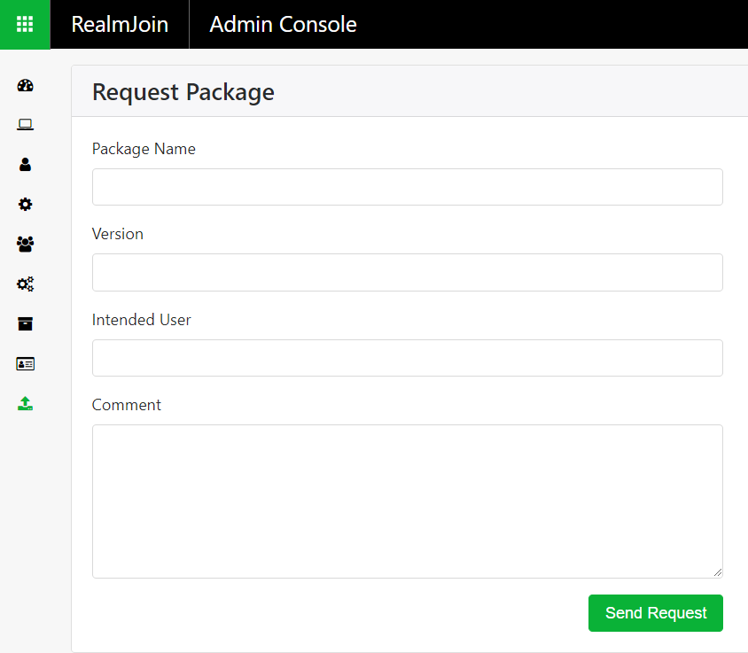

# Application Resources    
There are several ways to provide the applications for the distribution via RealmJoin. The RealmJoin infrastructure allows to choose from three approaches, depending on the individual packaging needs of every application.   

## Create the package  
With the RealmJoin infrastructure and the light-touch approach to packaging, it is possible for each customer to have a dedicated packaging team and create packages as needed. The process of creating packages is described in the [corresponding chapter](http://docs.realmjoin.com/managing-realmjoin.html#states) of this documentation.  

## Subscribe from the AppStore  
Glück&Kanja offer an ever-expanding library of already packaged up-to-date applications for uncomplicated rollout.  
The enabled RealmJoin administrator can subscribe to the desired applications, which will be instantly available for distribution.  
The shopping cart icon will open the AppStore. A complete list of all applications and currently available versions is shown, that might be filtered by name.  
  
  
Selecting a application will show some basic information and offer the possibility to subscribe, therefore adding it in your own software library and assign it to groups and users.  
  

After subscribing, the application will immediately added to list of available packages, and the entry might be edited if necessary. Applications from the AppStore will show technical details like optional parameters and suggestions for the assignment.  
  
  
To use the AppStore, please get in touch with Glück&Kanja for enablement.  

## Request packaging  
If an application is not listed in the AppStore, or is in need of customization, a packaging request can be sent to Glück&Kanja.  
The request option can be found via the last menu item:  
  

Please provide the necessary binaries as well as all installation requirements and additional information. It is essential for in-time processing, that the request only contains the necessary binares and a detailed installation guide. After submitting the request information (please do not forget a contact persons email address if the requesting admin account do not has a monitored inbox), you will be able to upload your zip file containing the binaries. After the upload, a ticket will automatically be created and the packaging request will be handled by the Glück&Kanja staff. **NOTE:** without attaching a file, no request will be created. If the request does not contain binaries, a *dummy.txt* file has to be attached.  
  
 